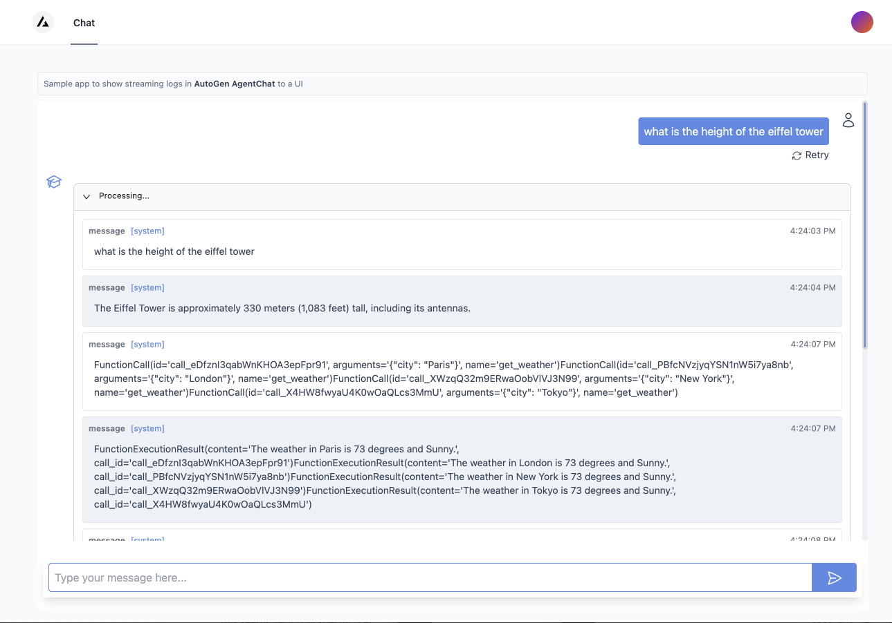

# AutoGen UI



> [!IMPORTANT]  
> This repo has been updated to use the [AutoGen AgentChat](https://microsoft.github.io/autogen/dev/user-guide/agentchat-user-guide/quickstart.html) interface based on the new AutoGen 0.4x api. Also, this app is only meant as an example on how to get started.

Example UI to demonstrate how to build interfaces using the [AutoGen AgentChat](https://github.com/microsoft/autogen) API. The UI is built using Next.js and web apis built using FastApi.

## What Does the App Do?

- [`autogenui.web.app.py`](autogenui/web/app.py) - FastApi backend that serves a simple `/generate` endpoint that takes a prompt and returns a response from a predefined [agent team](notebooks/default_team.json).
- [`autogenui.manager`](autogenui/manager.py) - provides a simple run method that takes a prompt and returns a response from a predefined [agent team](notebooks/default_team.json). Take a look at the [agent team](notebooks/default_team.json) json config file to see how the agents are configured. It gives a general idea on what types of agents are supported etc.
- [`autogenui.logging`](autogenui/logging/handler.py) - Implements a ConsoleHandler (prints to console) and a WebSocketHandler (streams to a connected UI session) for processing agent log events.
- [`frontend`](frontend) - Next.js frontend that provides a simple chat interface to interact with the backend.

## What's Next?

This app is clearly just a starting point. Here are some ideas on how to extend it:

- Extend the manager to support multiple team configurations from the UI
- Storing and loading interaction history in a database.
- Security - add authentication and authorization to the app

> [!TIP] Note
> [AutoGen Studio](https://github.com/microsoft/autogen/tree/main/python/packages/autogen-studio) is being rewritten on the AgentChat api to address most of the above points. Take a look at the implementation there for a more complete example.

## Getting Started

Note that you will have to setup your OPENAI_API_KEY to run the app.

```bash
export OPENAI_API_KEY=<your key>
```

Install dependencies. Python 3.9+ is required. You can install from pypi using pip.

```bash
pip install autogenui
```

or to install from source

```bash
git clone git@github.com:victordibia/autogen-ui.git
cd autogenui
pip install -e .
```

Run ui server.

Set env vars `OPENAI_API_KEY`

```bash
export OPENAI_API_KEY=<your_key>
```

```bash
autogenui # or with --port 8081
```

Open http://localhost:8081 in your browser.

To modify the source files, make changes in the frontend source files and run `npm run build` to rebuild the frontend.

## Development

To run the app in development mode, you will need to run the backend and frontend separately.

## Backend - with hot-reload

```bash
autogenui --reload
```

> [!TIP] Tip
> The UI loaded by this CLI in a pre-complied version by running the frontend build command show blow. That means if you make changes the frontend code or change the hostname or port the backend is running on the frontend updated frontend code needs to be rebuilt for it to load through this command.

## Frontend

```bash
cd frontend
```

Install dependencies

```bash
yarn install
```

Run in dev mode - with hot-reload

Set `NEXT_PUBLIC_API_SERVER` on the command line.

```bash
export NEXT_PUBLIC_API_SERVER=http://<your_backend_hostname>/api
```

Or create a `.env` file in the frontend folder with the following content.

```bash
NEXT_PUBLIC_API_SERVER=http://<your_backend_hostname>/api
```

where your_backend_hostname - is the hostname that autogenui is running on e.g. `localhost:8081`

```bash
yarn dev
```

(Re)build

Remember to install dependencies and set `NEXT_PUBLIC_API_SERVER` before building.

```bash
yarn build
```

## Roadmap

There isnt really much of a roadmap for this project. It is meant as a simple example to get started with the AutoGen AgentChat API. For a more complete example, take a look at the [AutoGen Studio](https://github.com/microsoft/autogen/tree/main/python/packages/autogen-studio) project.

## References

- [AutoGen Studio](https://arxiv.org/abs/2308.08155).

```
@inproceedings{dibia2024autogen,
  title={AutoGen Studio: A No-Code Developer Tool for Building and Debugging Multi-Agent Systems},
  author={Dibia, Victor and Chen, Jingya and Bansal, Gagan and Syed, Suff and Fourney, Adam and Zhu, Erkang and Wang, Chi and Amershi, Saleema},
  journal={EMNLP 2024},
  year={2024}
}
```

- [AutoGen](https://arxiv.org/abs/2408.15247).

```
@inproceedings{wu2023autogen,
      title={AutoGen: Enabling Next-Gen LLM Applications via Multi-Agent Conversation Framework},
      author={Qingyun Wu and Gagan Bansal and Jieyu Zhang and Yiran Wu and Shaokun Zhang and Erkang Zhu and Beibin Li and Li Jiang and Xiaoyun Zhang and Chi Wang},
      year={2023},
      eprint={2308.08155},
      archivePrefix={arXiv},
      primaryClass={cs.AI}
}
```
